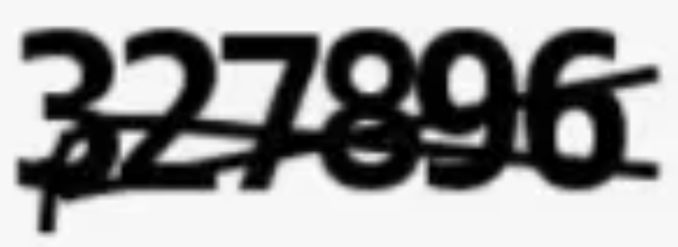
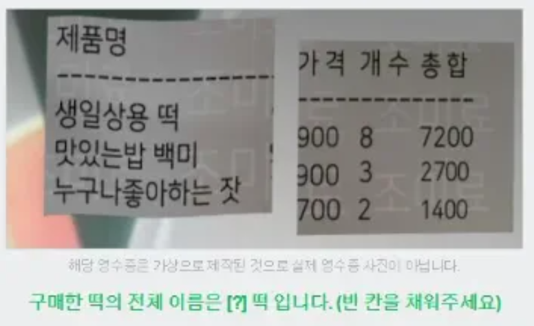
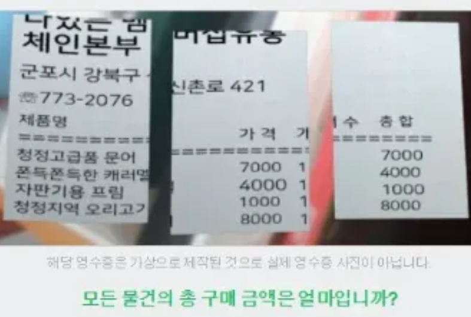
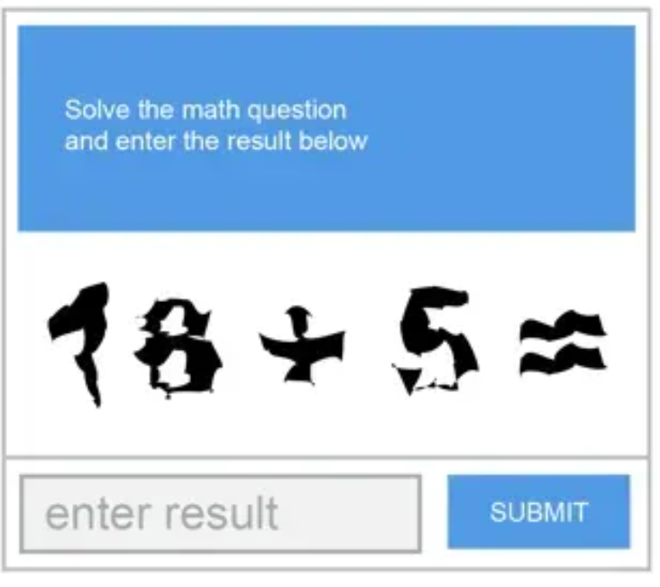
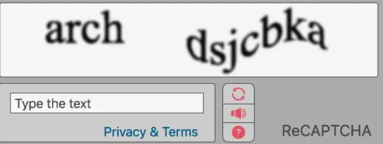

# AI CAPTCHA Assistant Documentation 🤖

[KOREAN](#korean) | [ENGLISH](#english)

## KOREAN

### 📚 개요
AI CAPTCHA Assistant는 다양한 종류의 시각적 문제를 해결하는 프롬프트입니다. CAPTCHA 해독부터 영수증 텍스트 추출, 수학 문제 해결까지 다양한 작업을 처리할 수 있으며, JSON 형식의 깔끔한 응답을 제공합니다.

### 🎯 주요 기능
- 왜곡된/취소선이 있는 CAPTCHA 해독
- reCAPTCHA 텍스트 추출
- 수학 연산 문제 해결
- 영수증/문서 텍스트 추출
- 질문-답변 형식의 문제 해결
- 다국어(한국어/영어) 지원

### 💻 사용 방법

1. 시스템 프롬프트 적용
   - [시스템 프롬프트](/prompts/captcha-assistant/system-prompt.md)를 GPT-4에 적용
   - 프롬프트 적용 후에는 이미지와 함께 요청 전송

2. 이미지 준비
   - 지원 형식: PNG, JPEG, GIF
   - 최대 크기: 5MB
   - 최소 해상도: 300x300px

3. 요청 형식
```json
{
    "image": "base64_encoded_image_or_url",
    "options": {
        "message": "추가적인 컨텍스트 또는 요구사항",
        "language": "ko|en|auto"
    }
}
```

4. 응답 해석
```json
{
    "type": "CAPTCHA 유형",
    "answer": "추출된 답변",
    "confidence": 신뢰도_점수,
    "details": {
        "language": "언어",
        "contains_numbers": boolean,
        "contains_letters": boolean,
        "requires_calculation": boolean
    }
}
```

### 📋 지원하는 유형 및 예시

| 유형 | 예시 이미지 | 설명 | 예상 응답 |
|------|------------|------|-----------|
| 취소선 CAPTCHA |  | 취소선이 그어진 숫자 인식 | `{"type": "strikethrough_captcha", "answer": "327896", "confidence": 0.98}` |
| 문서 질문형 |  | 영수증에서 특정 정보 추출 | `{"type": "receipt_question", "answer": "생일상용", "confidence": 0.95}` |
| 영수증 계산 |  | 영수증 금액 계산 | `{"type": "receipt_calculation", "answer": "20000", "confidence": 0.99}` |
| 수학 CAPTCHA |  | 수학 연산 해결 | `{"type": "math_captcha", "answer": "23", "confidence": 0.96}` |
| reCAPTCHA |  | 왜곡된 단어 인식 | `{"type": "recaptcha_text", "answer": "arch dsjcbka", "confidence": 0.97}` |

### 🔍 성능 최적화 팁
1. 이미지 품질 최적화
   - 밝기와 대비가 적절해야 함
   - 깨끗한 배경
   - 텍스트가 명확하게 보여야 함

2. 컨텍스트 제공
   - 문제의 유형을 명시적으로 설명
   - 필요한 경우 언어 지정
   - 특별한 요구사항 명시

3. 응답 처리
   - confidence 점수가 0.9 미만인 경우 재시도 권장
   - 복잡한 문제는 여러 번 시도하여 결과 비교

### ⚠️ 제한사항
- 이미지 품질이 매우 낮은 경우 인식률 저하
- 복잡한 수식이나 기호는 인식이 어려울 수 있음
- 심하게 왜곡된 텍스트는 정확도가 떨어질 수 있음
- 동시에 여러 개의 문제가 포함된 경우 처리 어려움

---

## ENGLISH

### 📚 Overview
AI CAPTCHA Assistant is a prompt designed to solve various types of visual challenges. From CAPTCHA decoding to receipt text extraction and math problem solving, it handles various tasks and provides clean JSON format responses.

### 🎯 Key Features
- Decode distorted/strikethrough CAPTCHAs
- Extract reCAPTCHA text
- Solve mathematical operations
- Extract receipt/document text
- Process question-answer challenges
- Multi-language support (Korean/English)

### 💻 How to Use

1. Apply System Prompt
   - Apply [system prompt](/prompts/captcha-assistant/system-prompt.md) to GPT-4
   - Send requests with images after prompt application

2. Image Preparation
   - Supported formats: PNG, JPEG, GIF
   - Maximum size: 5MB
   - Minimum resolution: 300x300px

3. Request Format
```json
{
    "image": "base64_encoded_image_or_url",
    "options": {
        "message": "Additional context or requirements",
        "language": "ko|en|auto"
    }
}
```

4. Response Interpretation
```json
{
    "type": "CAPTCHA type",
    "answer": "extracted answer",
    "confidence": confidence_score,
    "details": {
        "language": "language",
        "contains_numbers": boolean,
        "contains_letters": boolean,
        "requires_calculation": boolean
    }
}
```

### 📋 Supported Types and Examples

| Type | Example Image | Description | Expected Response |
|------|--------------|-------------|-------------------|
| Strikethrough CAPTCHA |  | Recognize numbers with strikethrough | `{"type": "strikethrough_captcha", "answer": "327896", "confidence": 0.98}` |
| Document Question |  | Extract specific information from receipt | `{"type": "receipt_question", "answer": "생일상용", "confidence": 0.95}` |
| Receipt Calculation |  | Calculate receipt amounts | `{"type": "receipt_calculation", "answer": "20000", "confidence": 0.99}` |
| Math CAPTCHA |  | Solve mathematical operation | `{"type": "math_captcha", "answer": "23", "confidence": 0.96}` |
| reCAPTCHA |  | Recognize distorted words | `{"type": "recaptcha_text", "answer": "arch dsjcbka", "confidence": 0.97}` |

### 🔍 Performance Optimization Tips
1. Image Quality Optimization
   - Appropriate brightness and contrast
   - Clean background
   - Clear text visibility

2. Context Provision
   - Explicitly describe problem type
   - Specify language when needed
   - State special requirements

3. Response Handling
   - Retry recommended if confidence score is below 0.9
   - Compare results of multiple attempts for complex problems

### ⚠️ Limitations
- Recognition rate decreases with very low image quality
- Complex formulas or symbols may be difficult to recognize
- Severely distorted text may result in lower accuracy
- Difficulty handling multiple problems simultaneously

### 🔄 Updates
- v1.0.0 (2024-10-26): Initial release
- v1.0.1 (2024-10-26): Added Korean language support
